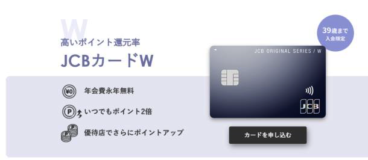
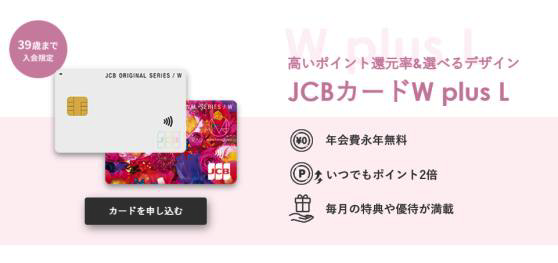
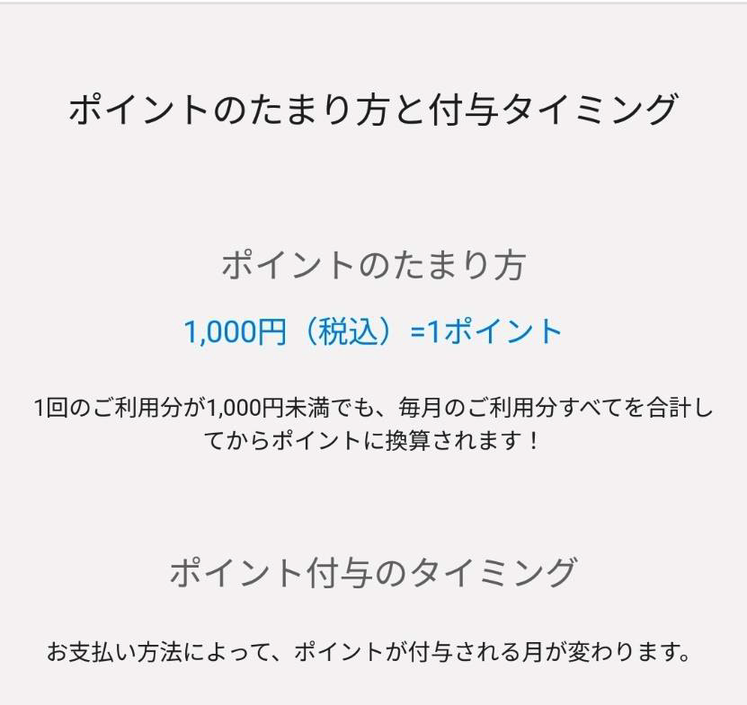

# JCB-W信用卡办理流程

写在前面：

①本篇主要是对于来日六个月内（想办理信用卡解决实际生活问题）的同学

②信用卡需要一张银行卡用来还款，所以要先办理完成一张日本的银行卡。

③在学生这个有限的身份中，性价比高的卡基本上都是无缘的，所以本篇提及的卡权益方面

基本属于“そのまま”的状况，所以，如果能有更好的推荐欢迎大家联系站主更新哦～

## 进入正题

[本卡——JCB カードW](https://www.jcb.co.jp/ordercard/kojin_card/os_card_w2.html?link_id=cojp_top_c4) <-- 申请渠道及官方信息

 以及他的孪生姐妹「JCBカードW plus L」据说有LADIES专属的福利，而且卡面更好看（我觉得）。有办理过的欢迎补充。 

## 本卡权益

所有下面的本卡都以W为例

1. 单次还款累计1000，积2分。亚马逊网购1pt=3.5円、线下划款1pt=4円。 

图里是JCB的一般情况所以为1pt。 

2. 没有年费。 
3. 给关西电力交电费燃气费目前双倍积分（2023-11-24）。

