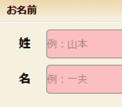
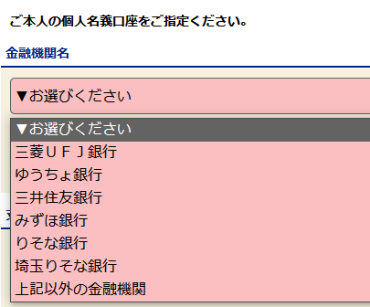

# JCB-W信用卡办理流程

> 作者[004]
>
> 最新更新日期：2023.11.25 01:30

## 0.写在前面

①本篇主要是对于来日六个月内（想办理信用卡解决实际生活问题）的同学

②信用卡需要银行账户用来还款，所以要先办理完成日本的邮储账户。

③在学生这个有限的身份中，性价比高的卡基本上都是无缘的，所以本篇提及的卡权益方面

基本属于“そのまま”的状况，所以，如果能有更好的推荐欢迎大家联系站主更新哦～

## 1.进入正题

本卡——[JCB カードW](https://www.jcb.co.jp/ordercard/kojin_card/os_card_w2.html?link_id=cojp_top_c4) <-- 申请渠道及官方信息

 以及他的孪生姐妹「JCBカードW plus L」据说有LADIES专属的福利，而且卡面更好看（我觉得）。有办理过的欢迎补充。 

## 2.本卡权益

所有下面的卡都以「カードW」为例

1. 单次还款累计1000，积2分。亚马逊网购1pt=3.5円、线下划款1pt=4円。 

图里是JCB的一般情况所以为1pt。 

2. 没有年费
3. 给关西电力交电费燃气费目前双倍积分（距目前为止：2023-11-24）

## 3.本卡优点**&**缺点

1. 是一张新来留学的学生比较容易申请的正经的日本发行的信用卡(它可以给GPT4付款)~~*你就这点出息么？*~~
2. 只有日元一种币种
3. 权益非常一般
4. 额度起步只有10万，并且计算周期（支付月）是从本月16日-下个月15号，结算日在下下月10号。这种计算方式意味着实际上你的一个月的额度要分给两个月使用

### 积分翻倍的店铺登录活动 

如图，要在MyJCB的APP中选择你想加入多倍积分活动的店铺（**一般都是无料的，但也要注意看一下哦**），然后点击确认即可加入活动，活动结束会在最后一个月的时候发邮件提醒你的。 

## 4.办理方式

官网申请，一周以内邮寄到家。 

ナンバーレス，最快五分钟通过审批。

申请网址：[JCB官网](https://www.jcb.co.jp/)下拉就能找到，也可以看一下其他种类的卡。

~~*站长温馨提示：陌生的链接不要点，点入陌生链接时不要输入隐私等个人信息。*~~

[本卡——JCB カードW](https://www.jcb.co.jp/ordercard/kojin_card/os_card_w2.html?link_id=cojp_top_c4)

## 5.办理流程

### 网申环节

 

 

姓名请填写英文全大写的字母(ＸＩＮＧ　 ＭＩＮＧ)。

片假名的地方只要和你在市役所和邮储银行提交的一致即可。 

### 职业和年收入 

职业学生，年收0。

### 还款银行账户 

在这里我们可以看到，目前的我们大银行里能办理的最好的选择就是[ゆうちょ銀行]。

接下来的部分只需要我们按照流程填写即可，如果遇到问题也可以来咨询楼主。 

关于登陆密码，虽然不建议设置成常用密码，但因为后面登陆要用，请至少不要忘记。

### 申请结束等待环节

一般等待一周就有结果。

### 申请状态确认

会给你留的邮箱发一封邮件。 如图，点击链接。

入会受付番号在邮件中有提示。

密码是你网申的时候设置的哦，没有忘记吧！

按照时间顺序会给你发以上所描述的三封信息，

第二封可以看到你卡的相关信息：额度之类的。

第三封可以看到你的卡现在的邮递进程。一般从看到第三封开始也就是2-3个工作日就送到家啦。要注意：需要本人凭相关证件签收哦。

### 签收快递后

因为这张卡是ナンバーレス，所以在卡面上没有你的卡号和CVV，你需要下载JCB的APP-MyJCB。

在信封里有这样的一张纸，扫码就可以下载app了。 

### APP**登录的**ID在哪里？

卡背面有一个QR CODE，用手机扫描之后进行重新登录，到最后就可以看到你的ID了。而除了第一次登录需要你的ID后，后面登录可以通过设置四位数的认证密码登录，所以也不会太需要ID。 

至此，所有的流程全部完成了！快去享受你的信用卡时光吧。 

## 结语

这张卡作为一张连甜品卡都算不上的底层信用卡，可以说适用的人群非常的狭窄，更多的用处是作为一个来日的过渡卡，在给自己的GPT4续费、交电费话费享受快捷支付的同时，也可以养一养自己的信用。 

最后给大家一个来自GPT3.5的忠告作为结束：

手握四张信用卡的站长：请养成良好的消费习惯，避免提前消费，很少有信用卡能提前还款，所以请确保自己的还款账户中资金充足。需要注意，在毕业离日后，你的邮储账户哪怕不注销也会被冻结，请尽量避免离日前仍有欠款的情况出现，并在离日后再三确认是否已经取消所有自动订阅的账户。