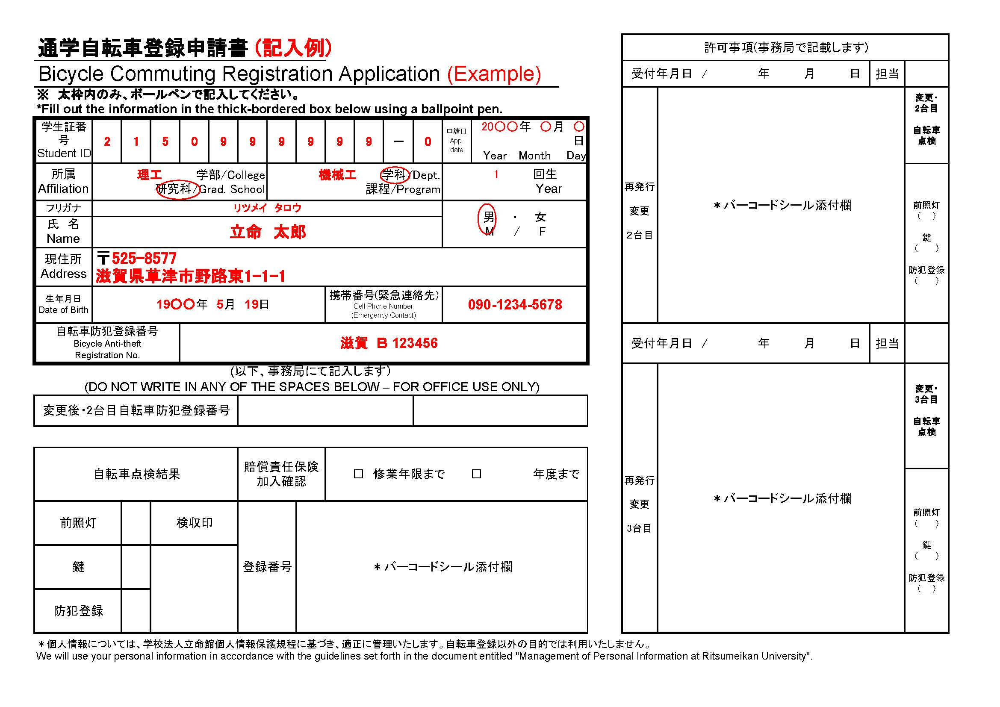
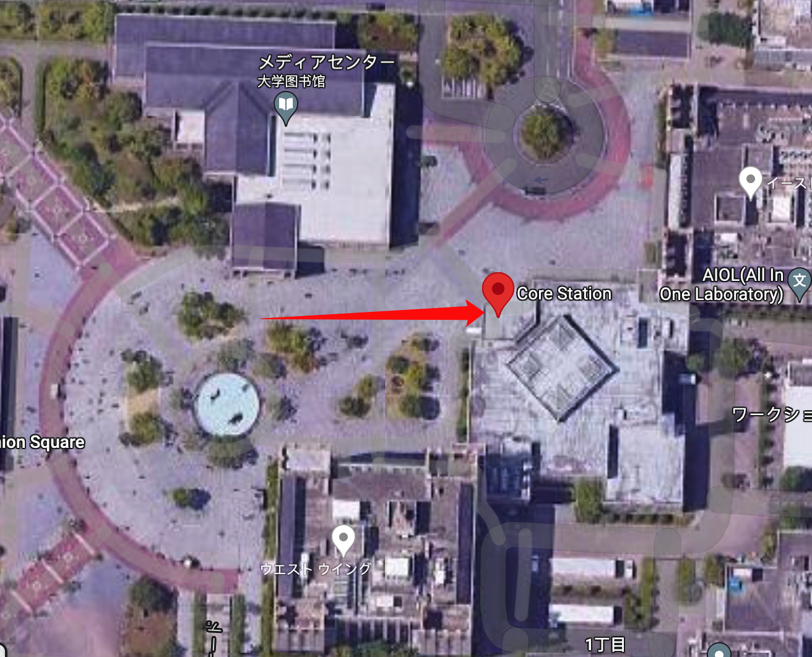
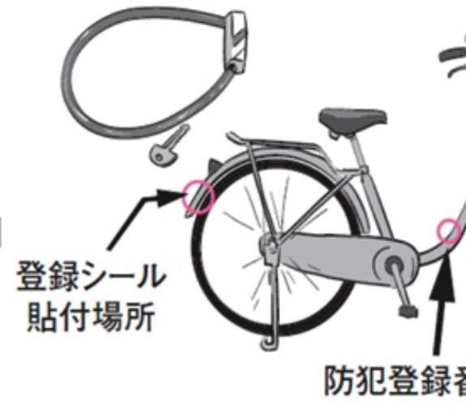

# 办理校园自転車停放许可

> 总结扩展于[自転車・バイク通学について-BKC](https://www.ritsumei.ac.jp/infostudents/bike/bkc)
>
> 最后更新于2020.10.21 15:04 (+9:00)

## Step0.购买一辆自行车

这里我就不建议大家去哪里买了~~也没人给我广告费~~，在Google地图上搜索「自転車」有很多店，不管是二手店还是一手店都是可以选择的（别跑哪个自転車修理店去了。。）

如果买一手车的话，基本最便宜的也在3w5日元，但你能得到崭新出场的性能优良的自行车。

如果在店里买二手车的话，1w-2w日元左右，是性价比极高的选项，但基本磨损严重，种类不多（不好看），不过这些在便宜的价钱上都不值一提。不过值得注意的是，看好轮胎是否完好漏不漏气之类的，换俩轮胎也要1w了。

当然**最建议**时刻关注着2+2健康生活群，里面有学长学姐可能会出，很便宜的（或者请顿自助白送你？）。在和别人交接自行车时，记得向对方要一下购买的时候的那些收据，上面有防盗登录的证明。

## Step1.线上学习并下载申请书

[线上讲座（录播）](https://www.pip-maker.com/?view=4jxm)预计时间15min，听完讲座并回答三个问题后，可以下载「通学自転車登録申請書」。

我个人建议看一下，但如果实在没兴趣**也可以直接[跳过Step1](https://luopzh.github.io/University-R/pages/jitensya#Step2.%E5%87%86%E5%A4%87%E6%9D%90%E6%96%99)**。

进入网址点击开始播放；

约3.5min后会让你选择自行车还是バイク。选择自行车就好；

约10min后会让你开始测试，有三道题，三道题的答案分别是：

讲座至此结束。

## Step2.准备材料

要准备的材料有：

- [通学自転車登録申請書](https://luopzh.github.io/University-R/files/200827BicycleCommutingRegistrationApplication.pdf)

- 学生证

- 保险证明

### あ-通学自転車登録申請書

查看并下载「[通学自転車登録申請書](https://luopzh.github.io/University-R/files/200827BicycleCommutingRegistrationApplication.pdf)」，**双面打印！**，随后按照下方示例填写正面的黑色加粗框内的内容，背面签个字就好。

⚠️注意，从**视频结束下载的pdf**是将第一页和第三页双面打印，第二页是示例页！

### い-学生证

学生证还能说点啥，不用复印，带着原件去。

### う-保险证明

一般买车的时候都会让你上保险，而且基本就是最大保额超过1亿日元的。

将能证明你**给你的车上保险的收据**与能证明**这份保险最大保额超过1亿**的页面复印在一张A4纸上。

如果真的没有符合要求保险可以去生协办理。

## Step3.给“门卫”检查自行车

在上两步都做完了之后，接下来就需要你骑着你心爱的的小自行车来到**BKC正门**前，推着来到保安待着的小屋子那里。

理论上你要跟屋子里的人说的是【来点检自行车お願いします】

如果不会说的话，你就把「自転車登録申請書」递给他，然后跟他「はい」，最后他在申請書的点检结果处打上勾签上名就可以「ありがとうございます」了。

## Step4.将所有材料提交

在完成上述所有步骤后，将自行车停去停车场，带着这些材料来到[コアステーション](https://maps.app.goo.gl/BzLzReycqkDTiKbn7?g_st=ic)１Fキャンパス管理室（周一到周五9:00-17:30）

在进门时向左一瞥就能看见了，离门很近。

跟工作人员说「自転車を登録」，并把材料交给ta，等待ta将资料收录，就可以带着一张**标有失效年份的贴纸**和一张**保护贴纸的塑料膜**离开。最后别忘了「ありがとうございます～」。

回到自行车场，将贴纸贴在自行车的后部，如图：

## 以上です。

至此，就完成了整个自行车登录的过程🎉

## 注意

- 在自己的公寓停车场停放时，要明确是否允许自由停放。部分会社需要你额外对停放自行车按月付费，但并不会对盗窃事故负责。如果没有停放权限被发现，会在第一时间警告，并之后进行处理。
- 骑车时不允许带耳机，并行，打伞，载人等危险操作，被发现可能会被思想教育。。。
- 一定要记得拔钥匙，在日本丢车的概率很小，但绝对不是0⃣️。~~你说是吧，学长~~
-  

最后放一些电话，大家有需要的时候可以打，不过我希望大家用不上。

首先，日本的报警电话与国内一样是**110**

**BKC学生オフィス**077-561-3917

**キャンパス管理室**077-561-2621

**草津警察署**077-563-0110

**南草津駅前交番**077-562-7360

**南草津病院**077-562-0724

**近江草津德洲会病院**077-567-3610

> 以上电话来源于讲座视频，不保证时效性。