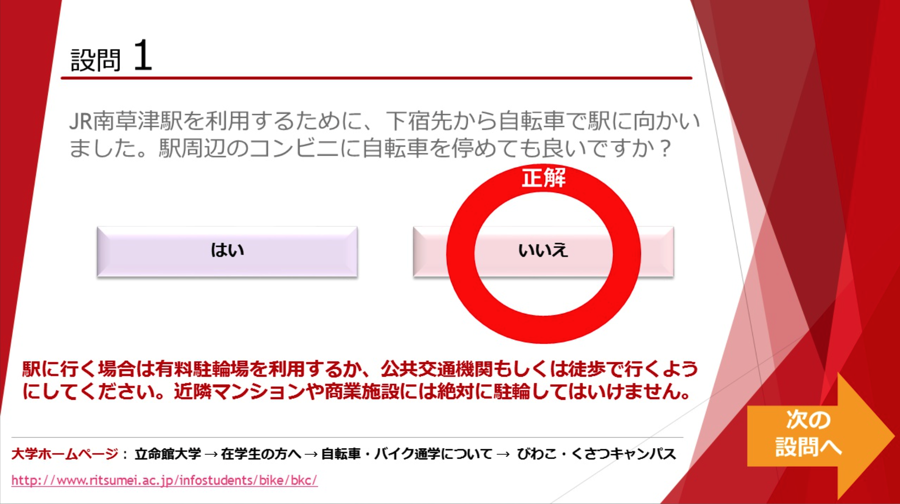
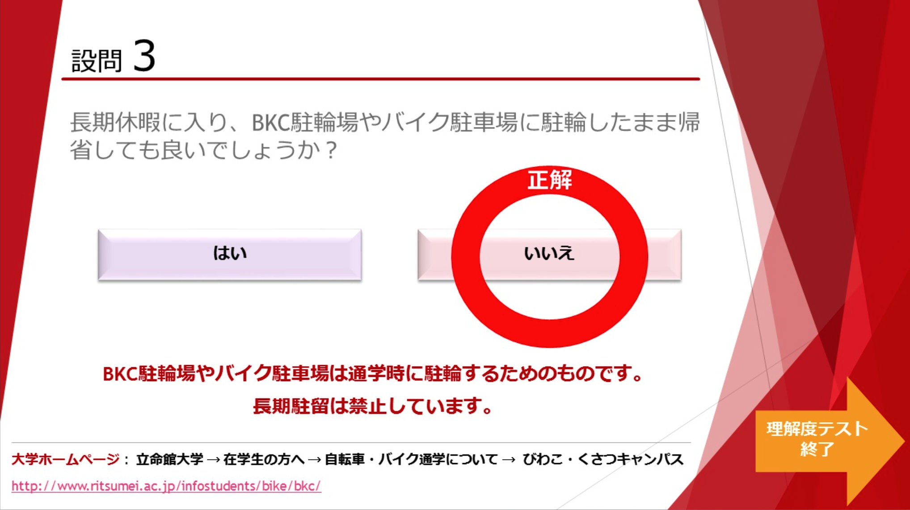
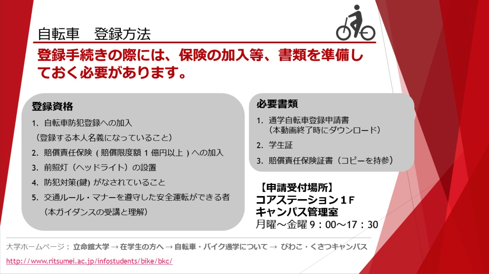
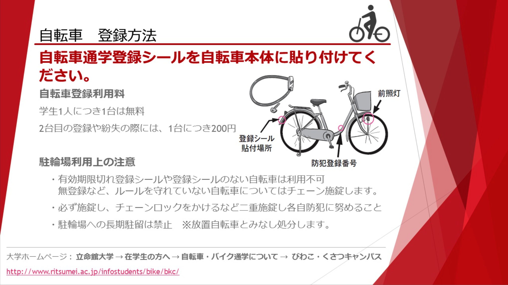

# 办理校园自転車停放许可

> 总结扩展于[自転車・バイク通学について-BKC](https://www.ritsumei.ac.jp/infostudents/bike/bkc)

## Step0.购买一辆自行车

这里我就不建议大家去哪里买了~~也没人给我广告费~~，在Google地图上搜索「自転車」有很多店，不管是二手店还是一手店都是可以选择的（别跑哪个自転車修理店去了。。）

如果买一手车的话，基本最便宜的也在3w5日元，但你能得到崭新出场的性能优良的自行车。

如果在店里买二手车的话，1w-2w日元左右，是性价比极高的选项，但基本磨损严重，种类不多（不好看），不过这些在便宜的价钱上都不值一提。不过值得注意的是，看好轮胎是否完好漏不漏气之类的，换俩轮胎也要1w了。

当然**最建议**时刻关注着2+2健康生活群，里面有学长学姐可能会出，很便宜的（或者请顿自助白送你？）。在和别人交接自行车时，记得向对方要一下购买的时候的那些收据，上面有防盗登录的证明。

## Step1.线上学习并下载申请书

[线上讲座（录播）](https://www.pip-maker.com/?view=4jxm)预计时间15min，听完讲座并回答三个问题后，可以下载「通学自転車登録申請書」。

我个人建议看一下，但如果实在没兴趣**也可以直接[跳过Step1](https://luopzh.github.io/University-R/pages/jitensya#Step2.%E5%87%86%E5%A4%87%E6%9D%90%E6%96%99)**。

进入网址点击开始播放；

约3.5min后会让你选择自行车还是バイク。选择自行车就好；

约10min后会让你开始测试，有三道题，三道题的答案分别是：

讲座至此结束。

## Step2.准备材料

要准备的材料有：

- [通学自転車登録申請書](https://luopzh.github.io/University-R/files/200827BicycleCommutingRegistrationApplication.pdf)

- 学生证

- 保险证明

### あ-通学自転車登録申請書

