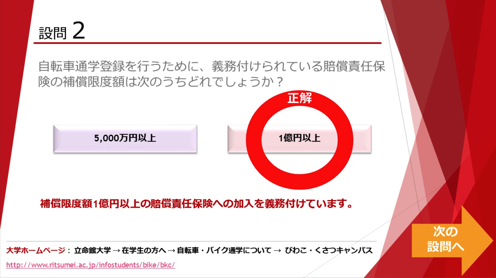

# 办理校园自転車停放许可

> 总结扩展于[自転車・バイク通学について](https://www.ritsumei.ac.jp/infostudents/bike/bkc)

## 1.线上学习并下载

[线上讲座（录播）](https://www.pip-maker.com/?view=4jxm)预计时间15min，听完讲座并回答三个问题后，可以下载「[通学自転車登録申請書](https://luopzh.github.io/University-R/files/200827BicycleCommutingRegistrationApplication.pdf)」。

进入网址点击开始播放

约3.5min后会让你选择自行车还是バイク。选择自行车就好

三道题的答案分别是

