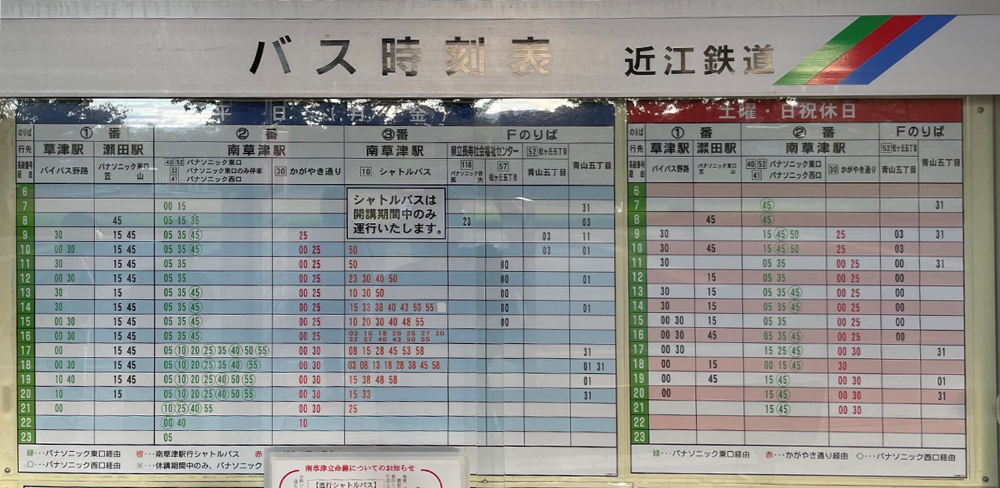
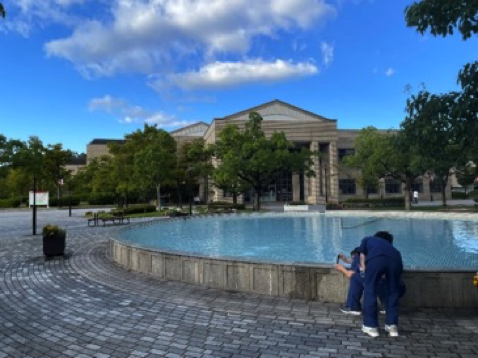
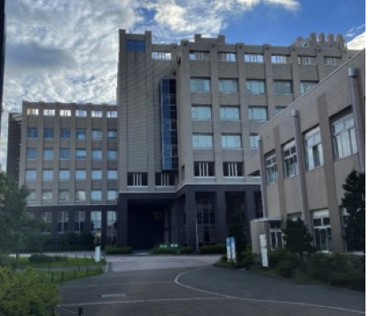
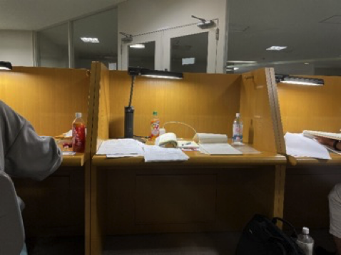
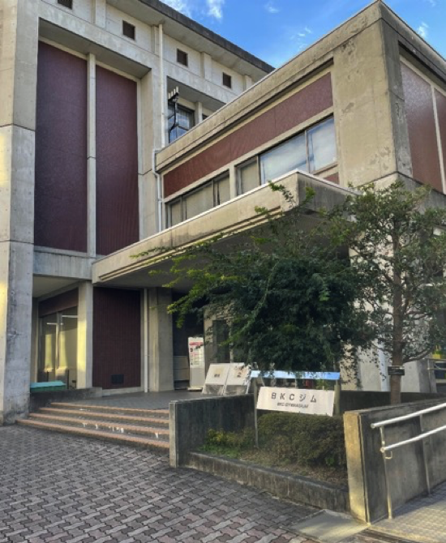
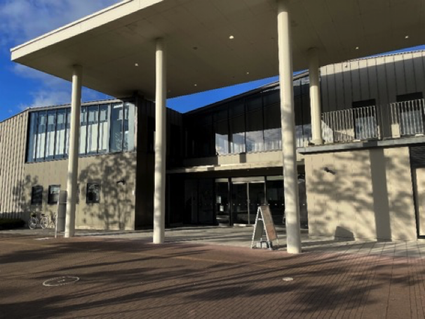
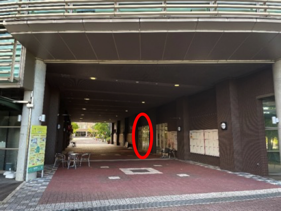
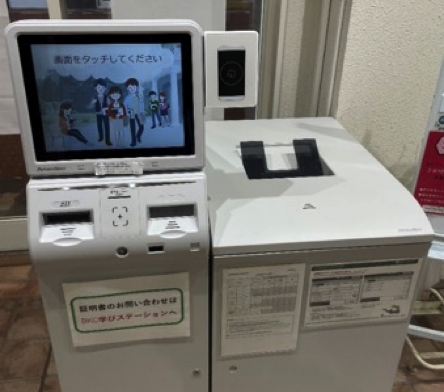
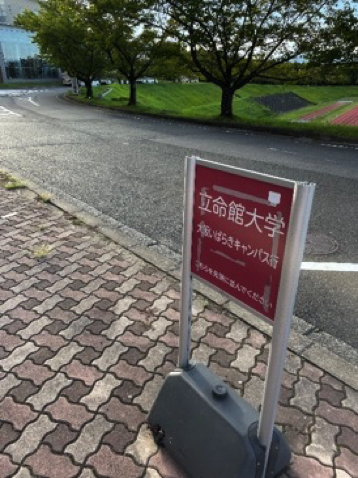
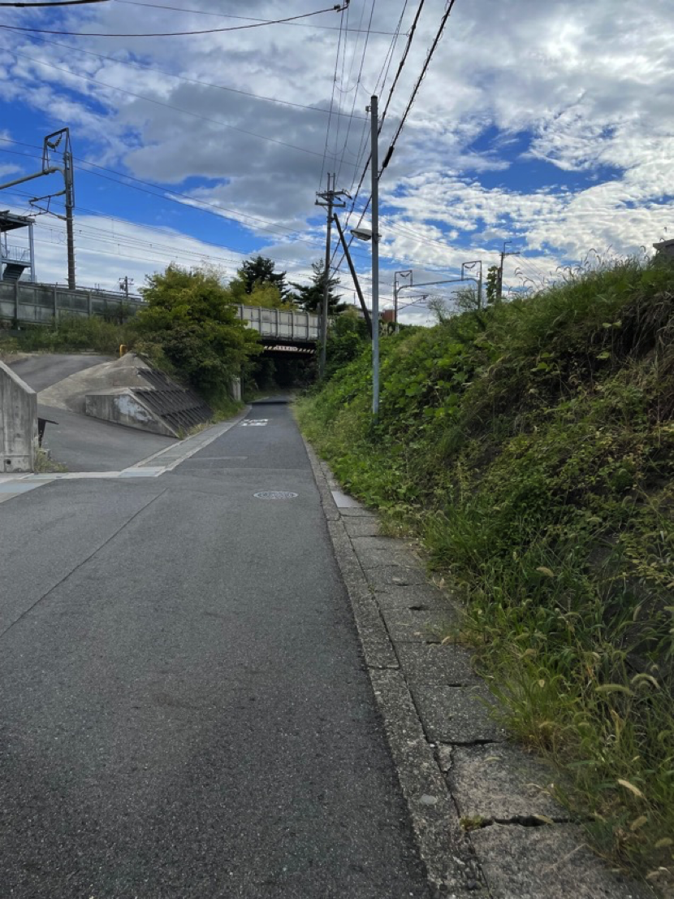

# 学校生活

> 作者 [002-热心学长](https://luopzh.github.io/University-R/pages/makefriends#002-%E7%83%AD%E5%BF%83%E5%AD%A6%E9%95%BF)

## 门外公交：学校车站时刻表

> 更新日期2022.09.21

左侧蓝色为周一到周五，右侧为周六周日以及假日。

里面的シャトルバス直达南草津车站，比较便宜。

> 站长提醒：注意看好F站的位置，F站是经停站，而不是始发站。

## 图书馆

位置：水池前（**メディアセンター**）和生协超市侧面（**メディアライブラリー**）

情报理工相关书籍在图一图书馆比较多（虽然也很少）。1楼有电脑和打印机可以使用，每个学生凭学生证在学校每年有1000张免费打印额度。

个人推荐图二图书馆4楼，环境舒适打游戏很爽。如图。1楼有两台打印机，3楼有电脑。

## 健身房（BKCジム）

位置：情报理工楼斜对面

要提前预约听一个讲座取得利用许可证才能使用，至2022.9.21采用的是预约制，每天能用1小时。免费。

快捷跳转：

[BKC体育館・ジム](https://www.ritsumei.ac.jp/lifecareer/activity/facility/gym/bkc/)        [讲座预约](https://select-type.com/rsv/?id=St4OYe3jA70)       [体育馆利用](https://select-type.com/rsv/?id=KatPteH9vEg)

## 游泳馆

位置：进大门左手的建筑

 同样需要听一个在线讲座后去右图受付处办理手续，然后才能使用，至2022.9.21采用的是预约制

星期一三五可预约，每次两小时。使用有料，每次300日元，也可以选择3个月1500日元。

快捷跳转：

[BKCスポーツ健康コモンズ](https://coubic.com/rits_spocommo_online#pageContent)        [预约](https://coubic.com/rits_spocommo_online/booking_pages#pageContent)

## 证明书发行机

位置：食堂前建筑红圈处进入

进入后向右侧看，

机器上可以开在学证明，预毕业证明等，还能开学割证（**免费！**）买新干线打八折哦~

刷学生证后输入密码，默认是自己的生日后4位。

还有开往大阪校区和衣笠校区的校际巴士票也能在这里买。生协超市也有售，150日元一张。

校际巴士在这里坐，公交车站往前走一点有图示牌子的地方。[校际巴士时刻表](https://www.ritsumei.ac.jp/infostudents/shuttlebus/)

## 彩蛋🥚

下图中道路右侧每年春夏交织的时候会长出很多树莓，学长亲尝酸甜可口，至今在世。

感兴趣的同学自己去探索这个地方吧~（提示：图中有新干线铁路）

> 站长（小声逼逼）：“真的会有人去找么”

