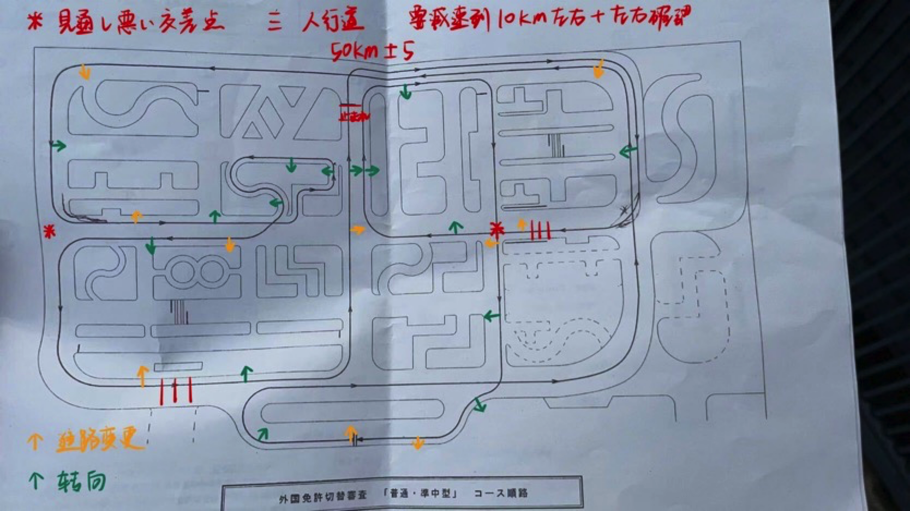

# 外免切替（外国免許の切替）把中国驾照换成日本驾照

> 作者：[002-热心学长](https://luopzh.github.io/University-R/pages/makefriends#002-%E7%83%AD%E5%BF%83%E5%AD%A6%E9%95%BF)

由于学长**在国内有驾照**，所以在这里分享换日本驾照的过程，换驾照比考驾照更经济也更简单。

首先你需要有国内的驾照，且取得后在**中国**待了3个月以上。

换驾照从开始到拿到驾照周期比较长，<u>可能需要好几个月的时间</u>，请做好心理准备。

## Step1：日语翻译件

需要一个驾照的日语翻译件，一般是找日本自动车联盟JAF（详见[外国運転免許証の日本語翻訳文について | JAF](https://jaf.or.jp/common/visitor-procedures/switch-to-japanese-license)）进行翻译。

在网页中找到申请书下载打印填写，加彩印驾照首页和副页，加4000日元到邮局用現金書留方式邮寄给JAF大阪支部

（地址〒567-0034　大阪府茨木市中穂積2-1-5）

之后他就会把翻译件邮寄给你。

## Step2：预约免許センター办理手续

> 学长在滋賀県運転免許センター办理

详见[外国の運転免許証から日本の運転免許証への切替手続｜滋賀県警 (shiga.lg.jp)](https://www.pref.shiga.lg.jp/police/menkyo/kokugai/301012.html#中国語)

需要一份国内考驾照时的成绩证明，格式要求不是很明确，但是只要能证明是真实考过了驾照的就行。

办理换领手续之前必须事先经过预约 （在电话预约之前请事先准备好外国驾照的日文翻译件，在留卡等）

驾驶执照中心(电话：077-585-1255)

预约受理时间：周一至周五 上午9:00 至11:00 / 下午1:00 至5:00 (节假日不受理)

## Step3：预约理论考试时间

**考试是有中文试卷的**，注意一下。

办完手续之后应该现场会让你预约好下次理论考试的时间，一般是一个月之后。

理论考试只考10道题，7道正确即可，题很简单，网上搜一下了解一下日本交规就行。

## Step4：预约路考时间

通过理论考试后会预约路考，一般也是一个月之后。

路考只有一个路线，需要记住路线图，弄清楚哪些位置应该做出什么反应

这是学长当时用的路线图，起点在最下面双线处。

進路変更需要打灯后看后视镜，反光镜，转头目视三个步骤，然后贴所转方向的路边，至此進路変更完成，然后转向。

見通し悪い点：需要减速到龟速并且左右观察后方可通过。

人行道：减速＋左右观察

止まれ：完全刹停＋左右观察

整个考场中央的十字路口处有个信号灯，注意即可。

上车前绕车观察，下车观察外侧再开门。

考试时该慢的地方慢，能快的地方也要快，要让考官知道你有能开车上路的能力就行。

顺利的话70分以上，你就能拿到驾照了，等所有人考完一起回到楼里宣布成绩。*（站长：我怎么记着你好像第一次没过）*

大阪有个中国人教练练车的场地，7000一小时，想要联系方式或者有其他问题可以找我问哦～